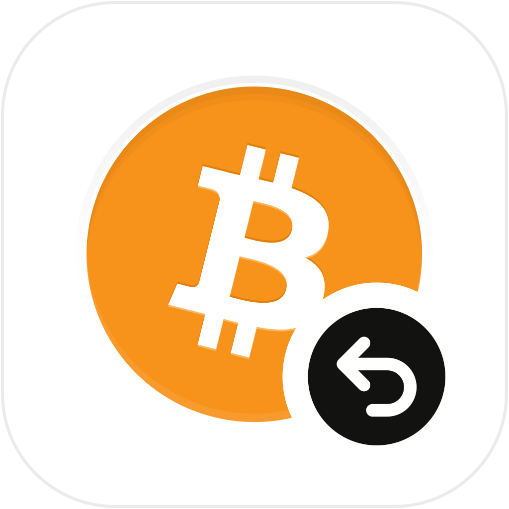
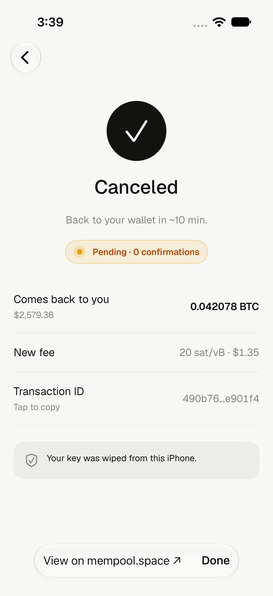

<p align="center">
  
</p>

<h1 align="center">Takeback</h1>
<p align="center"><strong>Cancel or speed up a pending Bitcoin payment.</strong><br>A native iPhone and iPad app built with SwiftUI.</p>

<p align="center">
  <a href="https://github.com/devdasx/takeback/actions/workflows/ci.yml"></a>
</p>

<p align="center">
  <a href="#how-it-works">How it works</a> ·
  <a href="Documentation/BUILDING.md">Build from source</a> ·
  <a href="Documentation/FAQ.md">FAQ</a> ·
  <a href="SECURITY.md">Security</a> ·
  <a href="CONTRIBUTING.md">Contribute</a>
</p>

Takeback finds unconfirmed Bitcoin transactions sent from a key you control and prepares a higher-fee replacement. **Cancel** sends the spendable amount back to an address derived from the same key. **Speed up** keeps the recipient destinations and raises the fee. Review the result, authenticate with the device, and broadcast.

No account, hosted wallet, or payment history to manage. The app holds imported keys and passphrases in memory for the current session.

> Cancellation is a competing Bitcoin transaction, not a reversal. It cannot undo a confirmed payment, and broadcast acceptance does not guarantee confirmation. A replacement can fail or lose the race to the original.

<p align="center">
  
</p>
<p align="center"><em>iOS simulator screenshot with synthetic payment data. Pending is not confirmed.</em></p>

## What you can do

- **Cancel or speed up:** choose the action on one review screen, with Cancel selected by default.
- **Choose the fee:** Next block, Fast, Medium, or a custom rate with a replacement minimum check.
- **Find payments across address types:** Taproot, native SegWit, nested SegWit, and legacy, with batched Electrum history and UTXO lookups.
- **Adjust the search:** accounts, search depth, address types, and custom derivation paths with a first-address preview.
- **Import locally:** paste, scan a QR code, or select a QR image; the reusable scanner includes supported BC-UR and BBQr multipart formats.
- **Use your server:** configure a mempool-compatible API and Electrum endpoints, with connection checks and fallback handling.
- **Track the replacement:** Pending → Confirmed status and an explorer link after sending.
- **Use native controls:** system navigation and back gestures, sheets, bottom toolbars, light/dark appearance, and adaptive iPhone/iPad layouts.

## How it works

1. **Enter your key.** Takeback validates the format locally. Add a BIP39 passphrase if your wallet uses one.
2. **Find pending payments.** Public derivation data drives a search across enabled paths. The default initial depth is 20 addresses on each applicable receive/change branch; active tails extend in batches of 20, up to 1,000 indices per branch.
3. **Review the action.** See the amount, destination or recipients, replacement fee, and any linked-payment warning. Transactions requiring another owner's signature cannot be changed with this key alone.
4. **Authenticate and send.** The app signs in memory, checks the replacement against the plan, broadcasts through the configured API with Electrum fallback, and verifies the returned transaction ID.
5. **Follow confirmation.** The result screen follows the public transaction status. Successful broadcast clears the secret session.

### Cancel versus Speed up

| | Cancel | Speed up |
| --- | --- | --- |
| Destination | An address derived from the same key | Original recipient destinations |
| Extra fee | Deducted from the amount returned | Taken from owned change when possible |
| No change output | Return amount must still cover the replacement fee | A supported single-recipient payment can deduct the extra fee from the recipient amount, shown before sending |
| Linked later payments | Their fees affect the replacement minimum; the warning explains the impact | Same descendant-fee consideration |

A multi-recipient payment without usable change cannot simply reduce an arbitrary recipient. Insufficient value, missing ownership, confirmed inputs, and network policy can prevent a replacement. See the [FAQ](Documentation/FAQ.md).

## Supported keys and Bitcoin standards

| Input | Support |
| --- | --- |
| Recovery phrase | English BIP39: 12, 15, 18, 21, or 24 words; optional passphrase |
| WIF private key | Compressed and uncompressed, with checksum and scalar checks |
| Hex private key | 64 hexadecimal characters, valid secp256k1 scalar |
| Mini private key | Supported `S…` format with validity check |
| Extended private key | Supported `xprv` / `zprv` imports; derivation depends on the imported root/account |

HD scanning covers BIP44, BIP49, BIP84, and BIP86. Importing an account-level extended key cannot recover sibling accounts or hardened ancestors. Uncompressed single keys are limited to their applicable legacy form. This is an on-chain Bitcoin tool; it does not cancel Lightning, exchange withdrawals, or confirmed transfers.

## Build from source

**Requirements:** macOS, Xcode 26.6 or newer, and the iOS SDK. The deployment target is iOS 17.0. The checked-in project includes pinned cryptographic sources and Geist fonts; no Swift package download is required.

```sh
git clone https://github.com/devdasx/takeback.git
cd takeback
open Takeback.xcodeproj
```

Choose the **Takeback** scheme and an iOS simulator. For your own iPhone or iPad, select your development team and an available bundle identifier in Xcode. No signing team or provisioning profile is distributed in this repository.

```sh
# Compile without signing or installing on a device.
xcodebuild -project Takeback.xcodeproj -scheme Takeback \
  -configuration Release -destination 'generic/platform=iOS' \
  CODE_SIGNING_ALLOWED=NO build

# Run the standalone key-validation checks on macOS.
sh Scripts/validate-key-vectors.sh
```

See [Building](Documentation/BUILDING.md) for XcodeGen, [Testing](Documentation/TESTING.md) for deterministic and opt-in integration checks, and [Architecture](Documentation/ARCHITECTURE.md) for the source map.

## Privacy and security

Keys and passphrases are not intentionally stored in preferences, files, Keychain, analytics, or network requests. App-owned secret buffers are explicitly zeroed; native editing buffers are cleared on teardown and session wipe. Swift and UIKit can make internal copies, so this is **not a guarantee that every memory copy can be overwritten**.

Sessions are cleared on return to Welcome, after successful broadcast, and after the background timeout (60 seconds, or earlier if background execution expires). Some retryable failures retain the session so you can adjust the fee or retry. Server settings and numeric search defaults persist; secret material does not.

Electrum servers receive queried script hashes and can correlate them with public addresses and your connection. Broadcast services receive the signed public transaction. An optional USD quote uses mempool.space. There is no bundled Tor client. See [Privacy](Documentation/PRIVACY.md) and the [security policy](SECURITY.md) for the exact boundaries.

## Project status

This repository publishes the app source and its tests. It is not an App Store download, a signed release, or an independent security audit. Compilation, deterministic tests, simulator interaction checks, and regtest validation are different kinds of evidence; none guarantees that a mainnet replacement will confirm.

The [validation record](Documentation/VALIDATION.md) reports the checks actually completed for this publication. The [changelog](CHANGELOG.md) describes the initial source snapshot.

## Documentation

- [Build and configuration](Documentation/BUILDING.md)
- [Architecture and transaction flow](Documentation/ARCHITECTURE.md)
- [Tests and local regtest](Documentation/TESTING.md)
- [FAQ and limitations](Documentation/FAQ.md)
- [Privacy and network data](Documentation/PRIVACY.md)
- [Security reporting](SECURITY.md)
- [Contributing](CONTRIBUTING.md)
- [Third-party notices](THIRD_PARTY_NOTICES.md)

## License and credits

Takeback is licensed under the [MIT License](LICENSE). Third-party components retain their own licenses, including libsecp256k1, Bitcoin Core's RIPEMD-160 implementation, the Muun recovery server list, Blockchain Commons reference portions, and Geist. See [Third-party notices](THIRD_PARTY_NOTICES.md).

Takeback is an independent project. References to Bitcoin Core, Muun, Blockchain Commons, Coinkite, and Vercel identify upstream work and do not imply endorsement.
